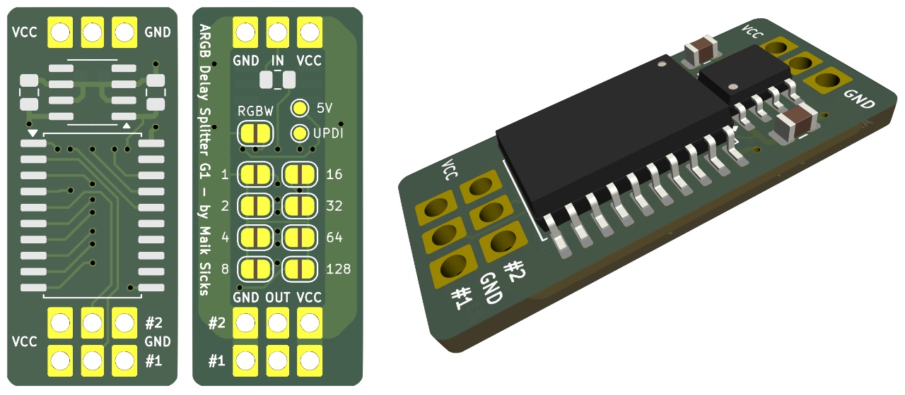

# Addressable LED Delay Splitter (WS2812B / SK6812)

This project implements a "delay splitter" for addressable LED strips (WS2812B / SK6812) using an [ATtiny406](https://www.microchip.com/en-us/product/attiny406) microcontroller.



------

## Description

The splitter takes a single LED data stream as input and provides two outputs:

- **Primary output**: This channel outputs the first N pixels of the input stream, where N is the configured pixel number.

- **Secondary output**: This channel outputs the remaining pixels of the input stream after the first N pixels.

### Basic use-case

- `pixel delay = 3`
    ```
                                 +- (1) - (2) - (3)
    [Controller] --- [Splitter] -+
                                 +- (4) - (5) - (6)
    ```

- `pixel delay = 3` and `primary passthrough = on`
    ```
                                 +- (1) - (2) - (3) - (4) - (5) - (6)
    [Controller] --- [Splitter] -+
                                 +- (4) - (5) - (6)
    ```

- Chaining
    ```
                                 +- (1) - (2) - (3)
    [Controller] --- [Splitter] -+
                                 +- [Splitter] ...
    ```
    ```
    [Controller] --- (1) - (2) - (3) --- [Splitter] ...
    ```

### How it works

Due to the high frequency of the WS2812B protocol (800kHz, 1.25µs per bit), the splitter uses many hardware features of the ATtiny406 to achieve the required timing:

- **Event System**
  Distribute the different signals (data input and control pin) to the various peripherals w(mostly) without CPU intervention.

- **CCL (Configurable Custom Logic)**
  Look-up tables (LUTs) are used to asynchronously route the input data stream to the outputs.

  - `Output_1 = Input_1 AND NOT Control_Pin`
  - `Output_2 = Input_1 AND Control_Pin`

- **TCA0 (Bit Counter)**
  Counts the number of bits / rising edges / events received via the event system. When the configured number of bits (delay) is reached, the control pin is switched to route the data to output 2.

- **TCB0 (Timeout Timer)**
  When the control pin is switched to output 2, this timer is started. If no rising edges are detected for a certain amount of time (indicating the reset condition of the WS2812B), the control pin is switched back to output 1.

## Configuration

The device can be configured via jumpers or by hardcoding values in `config.hpp`.

### Jumper configuration

There are 8 jumpers available to configure the pixel delay. The delay can be set from 0 to 255 pixels.

There is an additional jumper to change from RGB mode (24 bits per pixel) to RGBW mode (32 bits per pixel).

### Hardcoded configuration

The following parameters can be hardcoded in `config.hpp`:

- `PIXEL_DELAY` - Number of pixels to delay the output
- `RGBW_MODE` - Enable RGBW mode (32 bits per pixel instead of 24)
- `BITS_PER_PIXEL` - Number of bits per pixel (24 for RGB, 32 for RGBW)
- `SWAP_OUTPUTS` - Swap the primary and secondary outputs (output 1 and output 2)
- `PRIMARY_OUTPUT_PASSTHROUGH` - Enable passthrough of the primary output. When enabled, the primary output will not be turned off when the secondary output is active.
- `DISABLE_OUTPUT_1` and `DISABLE_OUTPUT_2` - Self-explanatory :)
- `LED_RESET_TIMEOUT` - Duration (in microseconds) to detect the reset condition of the WS2812B. The default is 50µs, which is a safe value for up to ~800kHz data rates.

Special parameters:

- `FORCE_SHORTED_CONTROL_PIN` - Forces the _shorted configuration pin mode_ to be enabled. This mode will be automatically enabled if jumper "128" is used. The control signal will then be inverted internally instead of setting the pin HIGH and LOW. 
  _Background: This mode had to be introduced because the hardware design of the splitter (revision 1) already had all Port B pins used for the configuration jumpers. The Event System only supports Port B pins as event generators on `ASYNCCH1`._

### Flashing

The project can be built and flashed using [PlatformIO](https://platformio.org/).

For flashing, an UPDI programmer is required. 
You can also build a simple UPDI programmer using an Arduino Uno/Nano with ATmega328P:

1. Download the [jtag2updi repository](https://github.com/ElTangas/jtag2updi).
2. Rename the `source` folder to `jtag2updi` (otherwise Arduino IDE will not open it).
3. Open the `jtag2updi.ino` file using the Arduino IDE.
4. Connect the Arduino, select the correct board and port in the Arduino IDE, and upload the sketch.

After this, you can connect pin 6 of the Arduino to the UPDI pin of the ATtiny406, and use PlatformIO to flash the splitter firmware.

## Limitations

There is a maximum amount of leds that can be connected to a single data line.

`N = ( (1 / f) - T_reset ) / ( B / R )`

Where:
- `N` = maximum number of LEDs
- `f` = frames per second (e.g. 60Hz)
- `T_reset` = reset time of the LEDs (e.g. 50µs)
- `B` = bits per pixel (e.g. 24 for RGB, 32 for RGBW)
- `R` = data rate in bits per second (e.g. 800,000 bps)


Example:
- With 60 Hz and RGB LEDs: 553 LEDs
- With 60 Hz and RGBW LEDs: 415 LEDs

- With 30 Hz and RGB LEDs: 1109 LEDs
- With 30 Hz and RGBW LEDs: 832 LEDs

## Ordering PCBs

Read the [README](./kicad/Addressable_LED_Delay_Splitter/README.md) in the `kicad` folder for details on the PCB design and order.
