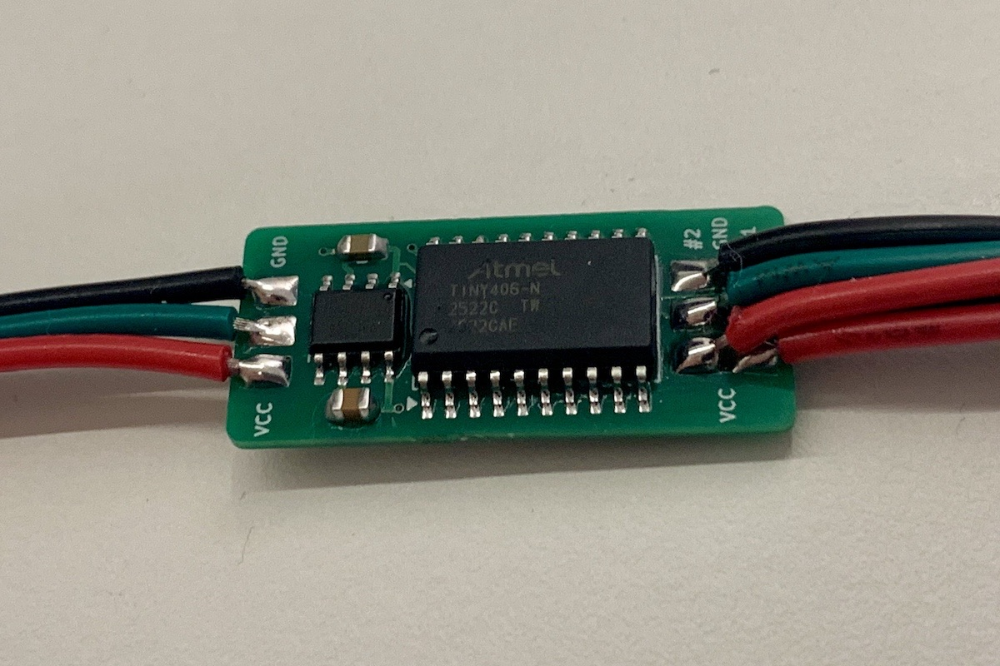
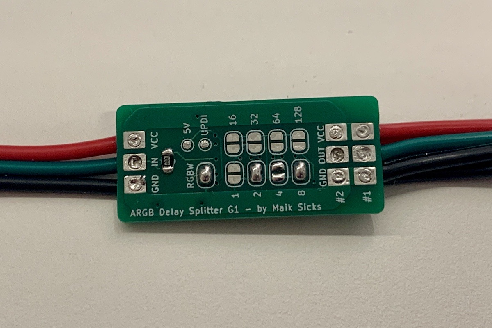
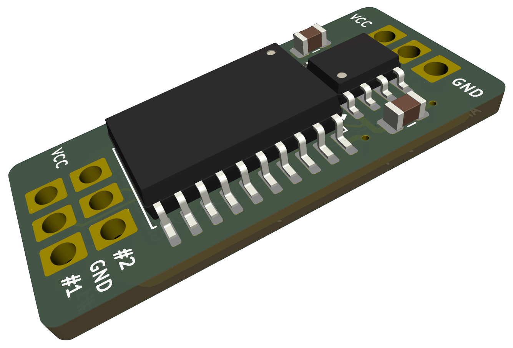
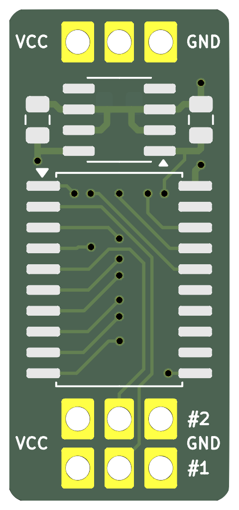
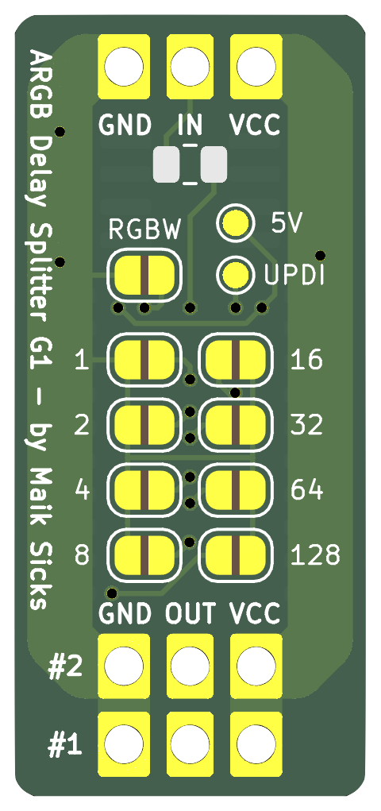

# Addressable LED Delay Splitter - Gallery

## Demo video

In this example video, the device is configured to send the first 10 pixels to the primary output and the remaining pixels to the secondary output.
Additionally, the RGBW jumper is set.

Direct links: [Video](../assets/media/demo.mp4), [Image](../assets/media/demo_setup.jpeg)

## Images

 
Note: I've hand soldered the PCB because I don't need more than a few devices. It is possible to get assembled PCBs. The size however requires the PCBs do be panelized, which increases the amount of final PCBs and parts a lot and thus the cost.

## Rendered images

 

